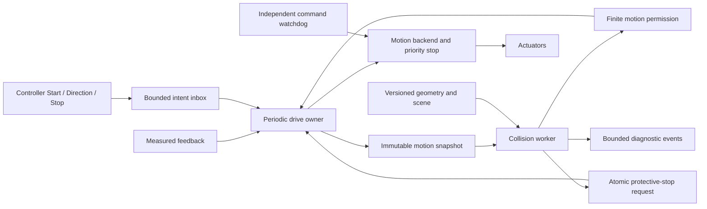

# Predictive collision avoidance for RTMC-System

Design revision 1 — 2026-09-14. Repository baseline: `ee5ef8e0e3a7f57d11cf8d8620aa985ed9a36690`.

**Deliverable status:** implementation architecture, a reproducible synthetic 3D reference dataset, and a C++ simulation implementation under `collision/`. The application now uses asynchronous preflight, predictive permits and a latched avoidance stop. This is not a released physical safety function: machine dimensions, calibration, measured feedback, backend command acknowledgement, dynamics and stopping performance remain unverified.

## 1. Purpose and scope

Prevent a moving positioner from contacting the fixed patient table, equipment, its own non-adjacent parts, or configured patient/accessory exclusion volumes. Evaluate the future occupied space of **every moving body**, including the end effector (EOF), during continued movement and braking. A free next position alone does not establish that movement is safe.

The controller requests motion with a direction. An asynchronous preflight check must authorize the initial movement before the actuator receives a movement command. Thereafter a collision worker runs independently of the drive. The drive performs only bounded permission and fault checks on its command path. If a future movement cannot be certified clear with enough room to stop, request a protective stop immediately. Hold the stopped state until a controller Stop acknowledges that motion session; never resume because the obstacle disappears or because the button remains held.

This version avoids collision by withholding movement and stopping. It does not steer around an obstacle, reverse automatically, or silently change the requested heading. Route planning and automatic speed optimization are future features with separate validation.

“Static” describes an object's world pose, not its mesh file. Robot geometry is normally rigid and preloaded but its pose is dynamic. A fixed table is static only while its installation and attachments remain unchanged. Patients, staff, drapes and loose cables cannot be assumed static during clinical motion. A synthetic patient box is a test obstacle, not a patient sensing system.

## 2. Existing system and concrete integration gaps

The architecture follows the existing C++17 module boundaries instead of adopting the nine-axis mechanism of the reference product.

| Existing location | Observed behavior | Required extension before avoidance can govern motion |
| --- | --- | --- |
| `drive/include/cDriveCalculator.h` | L1=75 cm, L2=100 cm; base=(-25,0) cm; A2 relative to A1 | Retain planar FK; add calibrated body transforms and unit adapters |
| `includes/commonDrive.h` | 50 ms integration step; 20 cm/s Cartesian command; 60 deg/s joint limit; 120 deg/s² profile ramp | Separate command limits from measured velocity, acceleration and guaranteed braking capability |
| `drive/src/cDriveCalculator.cpp` | Endpoint feasibility and per-tick joint-step budget | Pure trajectory proposal plus continuous path and stopping-envelope verification |
| `drive/src/cDriveController.cpp` | `StartDrive` sets speed and immediately calls `HandleJoystick` | Replace with pending preflight; no initial movement before permission |
| Same controller | `HandleJoystick` has e-stop/error checks but no running-state gate | Add explicit state machine and permission gate for every movement command |
| Same controller | `StopDrive` resets software profile and writes zero speed | Define actuator protective stop, queue cancellation and measured stop completion |
| `SystemController/src/cControlManager.cpp` | DRIVE callback goes straight to `iDrive::HandleJoystick` | Publish intents to the drive owner; collision worker must not mutate drive state |
| `CANMocker/src/cCANMocker.cpp` | Every Start uses payload `0x01`, decoded as +X, even when another button was selected | Start must carry the actual direction and session/command sequence |
| `PCAN/src/cPCANController.cpp` | Four axis targets sent as four frames; no common sequence/commit handshake | Add coherent trajectory commit or include axis start skew in prediction |
| `includes/iPCANController.h` | No measured joint feedback, stop acknowledgement or watchdog contract | Extend transport behind a motion backend interface |
| PCAN and HTTP mocker | Synchronous callbacks, stubbed transmission, console logging | Separate input, periodic drive, prediction and diagnostic scheduling |

The stored current position is a commanded position. Existing kinematic tests establish mathematical consistency, not that physical axes occupy that position. The scalar profile ramp constrains step size; it does not prove signed per-axis acceleration, jerk, reversal dynamics or physical deceleration. Do not substitute `JOINT_ACCEL_DPSS` for a measured braking bound.

The repository documents rotation about world Z. The new 3D world therefore uses X/Y horizontally and Z upward, despite the legacy `drivePosition.Y` comment saying “vertical coordinate.” Preserve numeric X/Y behavior and resolve physical axis conventions during calibration.

## 3. Requirements and invariants

| ID | Requirement |
| --- | --- |
| CA-01 | No movement on Start until the actual starting direction and a finite initial trajectory have a valid permission |
| CA-02 | Collision computation never waits on the drive path; drive checks have bounded execution |
| CA-03 | Every issued segment has certified occupied-space coverage through its latest possible stop |
| CA-04 | Prediction uses velocity, direction, possible acceleration, braking behavior, body size and EOF geometry |
| CA-05 | Hazard, stale result or unknown geometry revokes movement and initiates braking without waiting for controller Stop |
| CA-06 | Protective stop remains latched until a Stop for the affected session and verified standstill; a new Start requires fresh preflight |
| CA-07 | Late SAFE results, duplicate Start, held direction and old sessions cannot clear a stop latch |
| CA-08 | All robot–environment and relevant robot–robot pairs are covered, including A3/A4 rotation with unchanged EOF X/Y |
| CA-09 | Geometry/model changes invalidate permissions atomically; no object disappears during static/dynamic migration |
| CA-10 | Missing feedback, invalid numbers, solver exhaustion, queue overflow and deadline failure never produce CLEAR |
| CA-11 | Transport stop latency, queued commands, actuator response and stopping distance are included in the safety budget |
| CA-12 | Physical release requires measured models and stopping tests; the supplied synthetic data cannot authorize hardware |

Core invariant: from every allowed command state, the complete certified fallback stop remains collision-free under the declared uncertainty bounds. The worker renews permission before expiry. The drive can consume a previously certified segment without waiting; it cannot continue indefinitely on the last CLEAR result.

## 4. Components and execution model



The implemented module `collision/` contains `cSceneRegistry`, `cBodyKinematics`, `cTrajectoryPredictor`, `cProximityBackend`, `cCollisionSupervisor` and the bounded `cSpscMailbox`. `includes/iCollisionSupervisor.h` is the drive-facing supervision contract. The current simulator still uses `iPCANController`; the planned `iMotionBackend` feedback, atomic trajectory commit, stop acknowledgement and watchdog contract remains future hardware work.

| Execution context | Ownership and allowed work |
| --- | --- |
| Input receiver | Decode and validate inputs, publish intent; never integrate position or run geometry |
| Drive owner | Sole writer of lifecycle state, command sequence, profile and backend output; periodic execution independent of browser events |
| Collision worker | Owns proximity objects/caches, reads snapshots, builds predictions, publishes permissions or revocation |
| Feedback receiver | Publishes complete timestamped axis samples; never expose a half-updated pose |
| Model loader | Validates geometry offline, builds indexes, stages new immutable scene generation |
| Diagnostic worker | Serializes records and UI status outside drive/collision deadlines |
| Backend watchdog | Stops on missed command heartbeat even if the drive process stalls |

Use preallocated bounded single-producer/single-consumer queues at each ownership boundary. Multiple input producers require a dedicated consolidator or a verified bounded multi-producer queue. Use fixed-size value copies with acquire/release publication and explicit slot ownership. A plain two-buffer pointer swap is insufficient if a writer reuses a slot while the reader is copying it; likewise a seqlock over non-atomic C++ fields can have undefined data races. Choose a proven C++17 implementation and test slot reuse. Avoid real-time `shared_ptr` reclamation, allocation, file I/O, unbounded retries and blocking mutexes.

Protective-stop publication is a separate sticky atomic flag plus session epoch. It cannot be lost behind ordinary queue traffic. If an inbox or permit queue fills, preserve Stop/revocation and deny further motion; diagnostics may drop messages with a counter. Retire geometry generations off the drive thread after readers release them. Startup publishes no valid permission; shutdown requests stop, verifies standstill or invokes the independent stop path, then joins workers and releases transport.

“Non-blocking” means computational independence, not immediate start despite a pending check. The Start API returns `PendingPreflight`; the actuator remains stationary until the worker grants movement.

## 5. Motion lifecycle and signal ordering

| State | Event / condition | Action and next state |
| --- | --- | --- |
| DISARMED | New valid Start with nonzero actual direction, fresh feedback and scene | Create session; retain standstill; PREFLIGHT |
| DISARMED | Direction without Start | Ignore movement; record invalid lifecycle input |
| PREFLIGHT | Matching unexpired permission and actual state inside certified initial bounds | Commit first certified segment; RUNNING |
| PREFLIGHT | Hazard, unknown result, deadline or invalid input | Revoke; latch denial; AVOIDANCE_LATCHED (already stationary) |
| PREFLIGHT | Controller Stop | Cancel epoch; DISARMED; late permission is unusable |
| RUNNING | Valid matching permission for next segment | Commit within permitted time and state bounds; stay RUNNING |
| RUNNING | Collision predicted, permission expiry, scene change, feedback failure | Revoke; flush future targets; request coordinated protective stop; BRAKING |
| RUNNING | Controller Stop | Cancel motion; execute certified stop; BRAKING with controller acknowledgement recorded |
| BRAKING | Fresh measured standstill for configured dwell and stop acknowledged | AVOIDANCE_LATCHED if controller acknowledgement missing; otherwise DISARMED if faults permit |
| BRAKING | Stop missed its deadline, tracking escapes bound or backend fails | Escalate to independently engineered stop; FAULT_LATCHED |
| AVOIDANCE_LATCHED | Matching controller Stop after session began, verified standstill, no unresolved fault | Acknowledge session; DISARMED |
| AVOIDANCE_LATCHED | Direction, duplicate Start, obstacle clears, late CLEAR | Stay latched; no movement |
| FAULT_LATCHED | Controller Stop | Acknowledge request only; fault recovery/service procedure still required |
| Any | Emergency stop | Emergency function dominates; invalidate epoch and permits |

A Stop received while braking is remembered; the user need not release twice. Stop must match the active session, or be an explicitly global stop. A stale Stop from a previous session cannot acknowledge the current latch. New Start must be a new edge/session after Stop; continuously repeated Start frames cannot rearm motion. Communication loss while a button is held expires its command lease and triggers stop even if no release frame arrives.

Direction reversal or a speed increase outside the current permission invalidates that permission. Version 1 stops and performs a new preflight before accepting such a change. Supporting continuous direction changes later requires certifying the transition from the existing velocity, not assuming that the new direction takes effect instantly.

```text
Controller:  Start(direction, session) ----- held direction ----- Stop ----- new Start
Drive:       PREFLIGHT -> RUNNING ---------- BRAKING -> LATCHED -> DISARMED -> PREFLIGHT
Worker:      certify ----- renew ----- predicted hazard / revoke
Actuator:    stationary -> commanded motion -> braking -> stationary
                                      ^ stop requested here; never wait for controller Stop
```

## 6. Predictive stopping model

### 6.1 Inputs and uncertainty

Each coherent motion snapshot contains measured `q`, bounded `qdot` and `qddot`, sample timestamps, tracking-error bounds, commanded trajectory and queued segments, drive mode, payload/brake profile identifier, intent/session sequence and scene generation. Use monotonic time for deadlines. Encoder position alone does not yield trustworthy instantaneous velocity; use measured velocity or a bounded estimator whose delay/error is included.

Model the current sample's age, axis sample skew and command/feedback clock alignment. Invalid bounds, NaN, infinity, position discontinuity, unknown brake profile or zero guaranteed deceleration produce UNKNOWN. Unknown must inhibit starting or initiate the certified fallback while moving.

### 6.2 Reaction interval and horizon

For a sample timestamp `t_s`, certify the allowed continuation until the permission's latest allowed commit/expiry, plus all stop-request and actuator delays, then the full brake trajectory. Account for a permitted segment's duration and any uncancellable queued commands. There must be no uncovered interval between successive permissions.

For a conservative end-to-end budget define:

`T_react = T_sample_age + T_monitor_gap + T_compute + T_publish + T_drive_dispatch + T_bus_queue + T_actuator_response`.

These terms must be disjoint measured worst-case bounds; do not double-count overlapping work or substitute average latency. Permission expiry must force a stop no later than the reaction interval already certified. If permission duration or buffered motion exceeds this budget, extend the certified horizon accordingly or shorten permission.

`H >= T_react + T_brake_max + T_settle_guard`.

Never authorize motion just because an obstacle lies beyond a fixed lookahead. If the required stopping horizon exceeds the available prediction horizon, stop or refuse the request.

### 6.3 Scalar example for intuition and test oracles

For a body point traveling toward a plane, let current closing speed be `v >= 0`, maximum possible acceleration toward it during reaction be `a_plus >= 0`, guaranteed braking magnitude be `b_min > 0`, and geometric/measurement margin be `M`:

```text
v_react = v + a_plus * T_react
d_react = v * T_react + 0.5 * a_plus * T_react²
d_brake = v_react² / (2 * b_min)
d_required = d_react + d_brake + M
t_brake = v_react / b_min
```

Illustrative only: `v=0.20 m/s`, `a_plus=0.40 m/s²`, `T_react=0.080 s`, `b_min=0.50 m/s²`, `M=0.020 m` gives `v_react=0.232 m/s`, `d_react=0.01728 m`, `d_brake=0.053824 m`, and `d_required=0.091104 m` (91.104 mm). Stopping time after brake onset is 0.464 s. None of those braking/margin values are machine specifications.

The formula assumes constant immediate deceleration after reaction. Jerk-limited braking, actuator lag, gravity, load, compliance, brake engagement and torque saturation require a measured bound or a piecewise dynamic model. Use per-axis validated stop profiles over direction, configuration, load, temperature and supply conditions. No favorable averaging across test runs.

### 6.4 Whole-body motion

For every local body point `p`, compute `p_world(t)=T_world_body(q(t))*p`. A useful conservative speed bound is the sum of each upstream joint's `|qdot_j| * r_j_max` plus translational joint speeds; use the maximum lever arms over the interval. Acceleration includes angular acceleration and centripetal terms. Body-point Jacobians may tighten the bound but a bound evaluated at just one pose does not cover changing lever arms.

EOF translation can be almost zero while the elbow, C-arm rim or detector moves rapidly. At 60 deg/s, a point 0.8 m from a rotation axis already has about 0.838 m/s tangential speed for that joint alone. Current Cartesian command speed is therefore not an upper bound on every surface speed.

Generate a reachable tube that includes allowed nominal execution, uncertainty, and stopping initiated at **any possible time during the permit interval**. Checking only a single nominal stop at the end can miss a different earlier braking path when axes decelerate asynchronously. Certify coordinated braking or bound all admitted per-axis timing variations. Also check mechanical limits through the entire stop, not only the commanded endpoint.

## 7. Geometry algorithm selection

| Stage | Selected approach | Correctness and performance contract |
| --- | --- | --- |
| Scene indexing | Prebuilt static AABB BVH; updated dynamic AABB tree for articulated bodies | Objects use stable IDs; same geometry representation in both indexes |
| Candidate generation | Swept, margin-expanded AABBs over the entire reachable tube | Rotation and acceleration included; union of endpoint AABBs alone is insufficient |
| Simple-body distance | Analytic primitive distance where supported; box SAT for overlap and GJK for convex distance | Double precision; bounded iterations; report UNKNOWN separately from CLEAR |
| Complex C-arm | Compound convex parts, optionally refined with validated mesh BVH distance | Preserve opening; a single convex hull fills the C opening and creates excessive false stops |
| Continuous coverage | Conservative advancement or adaptive interval enclosure along actual joint-space trajectories | Every interval certified; no reliance on sparse pose sampling |
| Contact diagnostics | Optional EPA / contact details after overlap | Not needed to permit movement; penetration estimation is not collision prevention |

FCL is a candidate behind `iProximityBackend`: its primary documentation describes distance, collision and continuous queries plus primitive/mesh support. Pin an audited revision and solver configuration after supported shape-pair and motion tests. An API named continuous collision does not establish coverage of RTMC's accelerating articulated path; endpoint rigid-transform interpolation may follow a different path. [FCL documentation](https://github.com/flexible-collision-library/fcl).

For adaptive interval checking, calculate a lower bound on separation `d_lower` at a reference instant and an upper bound `D_move` on relative surface displacement across the interval. The interval is clear only if `d_lower - D_move > M_pair`. Otherwise subdivide or run a supported continuous solver. `d_lower` must include numerical error; do not treat an unconverged GJK estimate as a lower bound. On time/iteration/subdivision exhaustion return UNKNOWN and stop. No epsilon may shrink a forbidden envelope.

A box or convex proxy can establish clearance only when it encloses the actual geometry with a documented error bound. If overlapping proxies are refined, the refined geometry must retain validated enclosure and uncertainty coverage; a decorative mesh cannot override a conservative collision result. Mesh surface intersections alone also miss one closed solid fully inside another; include containment semantics or use conservative volumetric convex geometry.

Warm-start pair caches, nearest-pair prioritization, staged resolution and branch pruning improve speed. Never skip pairs merely because they were distant last cycle. Prototype broad-phase completeness against brute-force all-pair checks. For this modest body count, benchmark brute force too; a tree is useful only if its measured worst-case cost justifies its complexity.

## 8. Drive permission contract

```cpp
// Proposed contract, not production code. Use fixed-capacity storage.
struct MotionSnapshot {
    uint64_t session, command_sequence, state_sequence, scene_generation;
    MonotonicTime sampled_at;
    JointState measured;       // q, qdot, qddot bounds in SI
    TrackingBounds tracking;
    PendingTrajectory queued;
    MotionIntent intent;
    BrakeProfileId brake_profile;
};
struct MotionPermit {
    uint64_t session, command_sequence, scene_generation, stop_epoch;
    uint64_t segment_sequence;
    MonotonicTime earliest_commit, latest_commit, expiry;
    StateBounds admissible_start;
    CertifiedSegment segment;
    StopEnvelopeId fallback;
    ClearanceLowerBound minimum_clearance;
};
enum class Prediction { Clear, Hazard, Unknown };
```

The drive accepts a permit only if session/intent/scene/epoch match, time is valid, measured state remains inside the certified start set, no stop flag is set, and the exact segment is the one being sent. The segment's scheduled start must match the certified timing. A verdict that only says “next position clear” is not a permit. Worker and drive share a deterministic, side-effect-free trajectory generator; they must not call the same mutable `cDriveCalculator` concurrently.

Publish a preflight request as soon as Start is accepted; do not wait for a first movement command to create the worker's input. Maintain a finite pipeline of certified segments, with each sequence consumed at most once. While a committed segment executes, drive ticks monitor its state bounds and stop conditions without retransmitting it as a new segment. Renewal must be ready by the next segment boundary; loss of renewal invokes the already certified stop. A future bundle of segments may be published together only if the permission covers their complete execution and stopping envelope.

The final gate sits immediately before transport commit. Revocation racing with a commit may permit at most the documented in-flight command; that command and its delay must already be included in the stopping envelope. Backend sequence cancellation and command expiry prevent old targets executing after the stop. A check of an atomic boolean cannot retract a command already accepted by a motor.

```text
drive_tick:
  read coherent feedback and lifecycle events using bounded operations
  if stop/fault/feedback invalid: revoke; issue idempotent stop; return
  if state is not PREFLIGHT or RUNNING: do not issue movement; return
  publish current snapshot / pending trajectory request without waiting
  if PREFLIGHT and result still pending before preflight deadline: remain still; return
  if a committed segment is still executing within permission bounds: monitor; return
  read available permit without waiting
  if permit mismatches time/state/intent/scene: revoke; stop if moving; return
  commit exactly the certified segment with its sequence and expiry
  mark segment consumed; next tick publishes updated execution state

collision_cycle:
  read newest complete snapshot and matching immutable scene
  if invalid: publish sticky revoke with reason; return
  build candidate continuation and all allowed fallback stop motion
  compute conservative swept bounds; enumerate all relevant body pairs
  certify every interval against pair-specific margins within deadline
  if every pair is CLEAR: publish finite permit
  otherwise: publish sticky revoke; emit Hazard or Unknown diagnostic
```

The backend must distinguish “stop request accepted,” “braking underway” and “measured standstill.” Zero speed written to CAN is not a standstill acknowledgement. Standstill requires all relevant measured joint speeds below configured thresholds for a dwell interval, fresh samples, no continuing position drift outside the bound, and brake/hold status as applicable. Keep monitoring throughout braking.

## 9. Timing and capacity design targets

Initial simulation targets below are allocations to test, not hardware guarantees:

| Budget item | Candidate upper allocation |
| --- | ---: |
| Feedback age / acquisition skew | 10 ms |
| Gap until next collision evaluation | 10 ms |
| Collision computation | 5 ms |
| Result publication | 1 ms |
| Drive gate/dispatch | 5 ms |
| Transport queue and stop delivery | 9 ms |
| Actuator response before guaranteed braking | 40 ms |
| Total reaction budget | 80 ms |

Drive target period is 5 ms; collision release period is 10 ms with a 5 ms computation deadline. UI may remain 50 ms because it publishes intent rather than integrating motion. Keeping the existing 50 ms drive dispatch increases this example's reaction budget to 125 ms; recompute all envelopes. A permit may allow at most 10 ms of future continuation, and its timing must be proven consistent with these allocations. Measured scheduler jitter must fit within allocations or enlarge them explicitly.

Preallocate capacities for body count, convex parts, candidate pairs, trajectory intervals and event queues at scene load. Reject an oversized scene before activation. Fixed-capacity exhaustion during prediction gives UNKNOWN. Benchmark near-contact dense scenes, coincident faces, maximum axes moving, cold caches and model transition, not only average operation. Record maximum response latency and deadline misses on target hardware; percentile latency alone does not demonstrate a worst-case bound.

## 10. 3D reference data and coordinate contract

The accompanying [data specification](data-specification.md) defines the delivered files, dimensions, transform equations and replacement procedure. [Model parameters](../../data/collision/reference/parameters.json) are the editable source; generated files live under `data/collision/reference/generated/`.

Use meters, radians and seconds internally. Legacy centimeters and degrees convert once at the adapter boundary. World frame W is right-handed with Z up, X along the declared EOF travel, Y across it. W=(0,0,0) is the floor point below the closed-pose EOF, not the base axle. The base's planar offset stays (-0.25,0) m.

Preserve A1 in [-180,10] degrees and A2 in [0,180]; A3/A4 remain [-180,180] degrees as current assumed software limits. Heights, solid cross-sections, A3/A4 axis placement and housing dimensions are new explicit simulation assumptions. The C-arm transform is provisionally `Rz(A1+A2) * Ry(A3) * Rx(A4)` at the EOF X/Y and an assumed isocenter height. Actual LAO/CRAN axes and offsets are a release blocker, not inferred facts.

ARTIS pheno contributes only the robotic C-arm reference concept, 1.30 m maximum source-to-image distance and 0.955 m usable clearance. Those are reference-product specifications, not complete collision geometry. The detector's published active field is not its external housing size. Our two-link/four-axis robot and fixed table deliberately differ from the manufacturer's mechanism and multi-tilt table. [Siemens ARTIS pheno specifications](https://www.siemens-healthineers.com/angio/artis-interventional-angiography-systems/artis-pheno), [Siemens system overview](https://academy.siemens-healthineers.com/_/en-us/artis-pheno-system-overview-us/).

No OEM CAD, manufacturer-specific enclosure accuracy, purchased table model or physical patient scan is claimed. The dataset is marked `simulation_only`; production loading must reject it regardless of whether an individual preview looks clear.

## 11. Static/dynamic model evolution

Separate immutable `GeometryAsset` from `SceneObject` pose/mobility and from `MotionSource`. A rigid robot body uses joint kinematics; fixed installation uses a calibrated constant pose; tracked equipment later supplies timestamped pose and bounded future motion. All use the same proximity API.

Maintain static–dynamic and dynamic–dynamic queries, plus initialization validation of static–static configuration. A fixed-base robot's links always belong to the dynamic index even while stopped. Same rigid-body internal parts may be excluded; adjacent joints require reviewed local contact regions, not blanket link exclusions. Keep the rest of each adjacent pair eligible for self-collision testing.

For version 1, migrate a static obstacle to dynamic only at verified standstill: build a complete new generation off-thread; validate all objects/frames and the motion source; atomically activate generation; invalidate cached permits; perform new preflight. Keep the old scene active until the complete replacement is ready. A future live migration must conservatively cover old and new occupied sets and tracking uncertainty throughout handover.

Tracked objects require maximum age, calibration, velocity/acceleration bounds and uncertainty growth with prediction time. Loss or occlusion does not remove the object. Retain a conservative reachable region or stop if its movement cannot be bounded. Deformable patient motion and cables require their own envelope/sensing model; switching an enum cannot supply that information.

## 12. Failure modes and recovery

| Failure / bottleneck | Response or mitigation | Required evidence |
| --- | --- | --- |
| Collision worker hangs | Permit expires; drive stops; independent backend watchdog covers drive failure | Inject worker and full-process stalls |
| Solver runs long near contact | Bound iterations and intervals; UNKNOWN prevents renewal | Adversarial near-parallel/contact cases |
| Coarse proxies cause frequent stops | Tighter validated convex decomposition; refine only within enclosure/error contract | False-stop measurements and enclosure tests |
| Excess pair count | BVH, conservative swept pruning, warm starts; capacity gate | Brute-force oracle plus worst-case benchmark |
| Scene/feedback unit or frame mismatch | Reject metadata mismatch; calibrated marker checks | cm/m, deg/rad, handedness fault injection |
| Sequential axis delivery alters path | Atomic sequence commit or bounded axis skew in reachable tube | Bus delay/reorder/drop tests |
| Drive brake slower under load | Conservative load/configuration braking profile | Measured worst-case stopping trials |
| Stale SAFE arrives after Stop | Epoch/sequence validation; sticky latch | Event permutation tests |
| Stop command cannot be delivered | Independent stop/watchdog function; fault latch | Cable loss and bus saturation trials |
| Abrupt torque removal permits sag | Engineer gravity-safe braking/hold; do not assume power removal is safe | Mechanical/drive failure analysis |
| Patient/accessory outside model | Presence sensing or controlled exclusion volume with uncertainty | Setup validation and tracking-loss tests |
| Startup already intersects obstacle | Inhibit standard movement; diagnosed service recovery only | Overlap/containment fixtures |

The exact independent protective-stop mechanism must follow the machine's drive and mechanical design. Emergency stop remains distinct from normal predictive protective stopping. Recovery movement from an invalid/overlapping pose needs a separately reviewed mode; it is not authorized by reversing the joystick in the normal state machine.

## 13. Verification and acceptance matrix

Existing `tests/test_kinematics.cpp` remains the planar regression suite. Add future tests below with a virtual monotonic clock, fake backend, delayed feedback and controlled worker scheduling.

| Test ID | Scenario and acceptance |
| --- | --- |
| AVOID-01 | Each of eight Start directions preserves actual intent; denied Start emits no movement target |
| AVOID-02 | Drive tick remains bounded while worker sleeps indefinitely; missing permission stops before certified expiry |
| AVOID-03 | Next pose clear but brake trajectory intersects table: deny/stop before unsafe continuation |
| AVOID-04 | Obstacle between clear endpoints: continuous check finds it |
| AVOID-05 | Pure A3/A4 rotation, stationary EOF, detector rim approaches table: stop predicted |
| AVOID-06 | A1/A2 elbow sweep hits obstacle while EOF remains clear: stop predicted |
| AVOID-07 | Hazard clears while button held: no restart; Stop then fresh Start required |
| AVOID-08 | Stop arrives during braking: acknowledgement remembered; still wait for measured standstill |
| AVOID-09 | Late permit, duplicate Start, reordered Stop, old scene or wrong session: cannot authorize movement |
| AVOID-10 | NaN, timestamp jump, stale feedback, unknown brake profile, overflow or solver exhaustion: UNKNOWN |
| AVOID-11 | Command queued across revocation: cancel/reject stale sequence; in-flight movement inside certified tube |
| AVOID-12 | Delayed and asynchronous per-axis brakes: every admitted stop path remains clear |
| AVOID-13 | Static/dynamic generation change: no missing object and no permission survives transition |
| AVOID-14 | Near-touching, contained solids, thin obstacles and nearly parallel faces: no false CLEAR |
| AVOID-15 | Broad-phase candidates versus brute-force swept oracle: no missing potentially colliding pair |
| AVOID-16 | Braking distance plane fixture reproduces 91.104 mm example; no acceleration/brake-limit substitution |
| AVOID-17 | Home/extended and rotated frame transforms preserve repository planar FK and relative A2 |
| AVOID-18 | Stop path crosses joint limit or prediction horizon too short: movement refused |
| AVOID-19 | Synthetic or uncalibrated asset in hardware mode: load denied |
| AVOID-20 | Hardware trials across speed, direction, load and joint configurations: measured swept motion stays inside certified bounds and retains required clearance |

Property checks: increasing uncertainty, reaction latency or maximum approach acceleration must not make a previously denied case clear; decreasing guaranteed braking cannot reduce stopping requirements. Compare geometry against independent analytic fixtures and dense numerical sampling as a regression oracle, while recognizing sampling itself is not continuous proof. Race detection and adversarial event schedules supplement state-machine tests.

Release gates: (G1) measured geometry and transform enclosure; (G2) pure trajectory agreement with backend interpolation; (G3) software lifecycle/permission fault tests; (G4) measured timing and stopping bounds; (G5) integrated hardware evidence with independent protective measures. Passing current artifact checks establishes none of G2–G5.

## 14. Ordered implementation work packages

| Package | Work and outputs | Exit gate / dependency |
| --- | --- | --- |
| WP0: machine contract | Measure A3/A4 frames, link solids, table and accessories; define backend interpolation, feedback, brake/hold behavior | Signed calibration and uncertainty register; required for physical use |
| WP1: deterministic motion owner | Preserve Start direction; implement states, event sequencing, periodic loop and pure trajectory proposal | AVOID-01/07/08/09; existing kinematic regression |
| WP2: geometry and static scenes | SI adapter, body transforms, validated loader, compound primitives, static index | AVOID-14/15/17/19; simulation may use supplied dataset |
| WP3: prediction and stop envelope | Bounded velocity/acceleration state, delay/queue model, whole-body continuous checks | AVOID-03/04/05/06/12/16/18 |
| WP4: asynchronous supervision | Bounded mailboxes, exact segment permits, expiry/revocation, worker deadlines | AVOID-02/09/10/11; concurrency and timing evidence |
| WP5: backend and hardware | Feedback, coherent commit, priority stop/cancel, watchdog and measured standstill | AVOID-11/12/20; G4/G5 |
| WP6: dynamic obstacles | Motion-source adapter, uncertainty propagation and atomic scene migration | AVOID-13 plus stale/occluded tracking tests |

WP1 and WP2 can proceed independently; WP3 needs their contracts. WP4 integrates WP3; WP5 determines the numerical bounds used for physical release. WP6 extends object motion without replacing geometry or the permission contract. Do not wire a partial geometry check into the existing Start path and describe it as completed avoidance.

## 15. Design decisions requiring machine evidence

| Open item | Current working choice | Evidence needed |
| --- | --- | --- |
| EOF meaning | End effector, following repository kinematics document | Confirm actual attached assembly and relevant accessories |
| Fixed patient table | Floor-fixed synthetic table; no table joints | Actual CAD, installed pose and deflection/load envelope |
| A3/A4 transforms | Intrinsic Y then X after A1+A2 heading | Mechanical drawings, encoder sign/zero calibration |
| Arm height separation | Two horizontal links at different heights | Physical link housings, bearings and joint geometry |
| Actual braking | No released profile | Direction/load/configuration trials and worst-case latency |
| Stop acknowledgement | Session Stop plus measured standstill | Controller protocol and required operator indication |
| Initial timing | 80 ms illustrative reaction budget | Target scheduler, CAN and actuator measurements |
| Patient/staff coverage | No real-time sensing in current repository | Intended scope and sensing/controlled-space design |

These unknowns do not prevent simulation implementation, but the software must expose them as unvalidated and refuse hardware authorization.

## 16. Source and safety-process context

The algorithm and concurrency decisions above are engineering proposals, not requirements quoted from a standard. Applicable device risk management includes [ISO 14971:2019](https://www.iso.org/standard/72704.html). Medical electrical basic safety and essential performance are addressed by [IEC 60601-1](https://webstore.iec.ch/en/publication/67497); interventional X-ray equipment has particular requirements under [IEC 60601-2-43:2022, FDA recognition](https://www.accessdata.fda.gov/scripts/cdrh/cfdocs/cfStandards/detail.cfm?standard__identification_no=44449). Software lifecycle planning should assess [IEC 62304](https://webstore.iec.ch/en/publication/6792) and applicable amendments/market recognition. Applicability, classification and residual risk require device-specific review; none of these sources certifies the proposed algorithm or synthetic model.

Primary sources were consulted on 2026-09-14. Source product dimensions are distinguished from RTMC constants and synthetic assumptions in the data package. Manufacturer transport dimensions are not used as collision envelopes.
