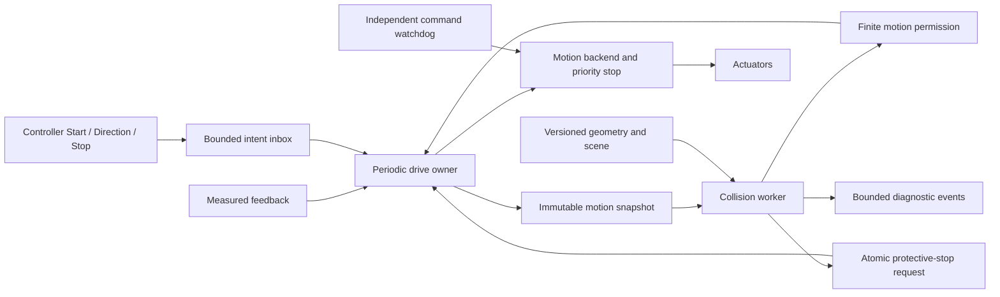
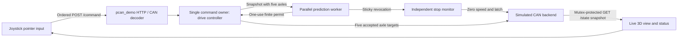
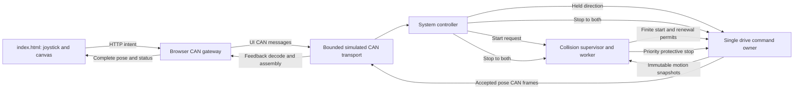
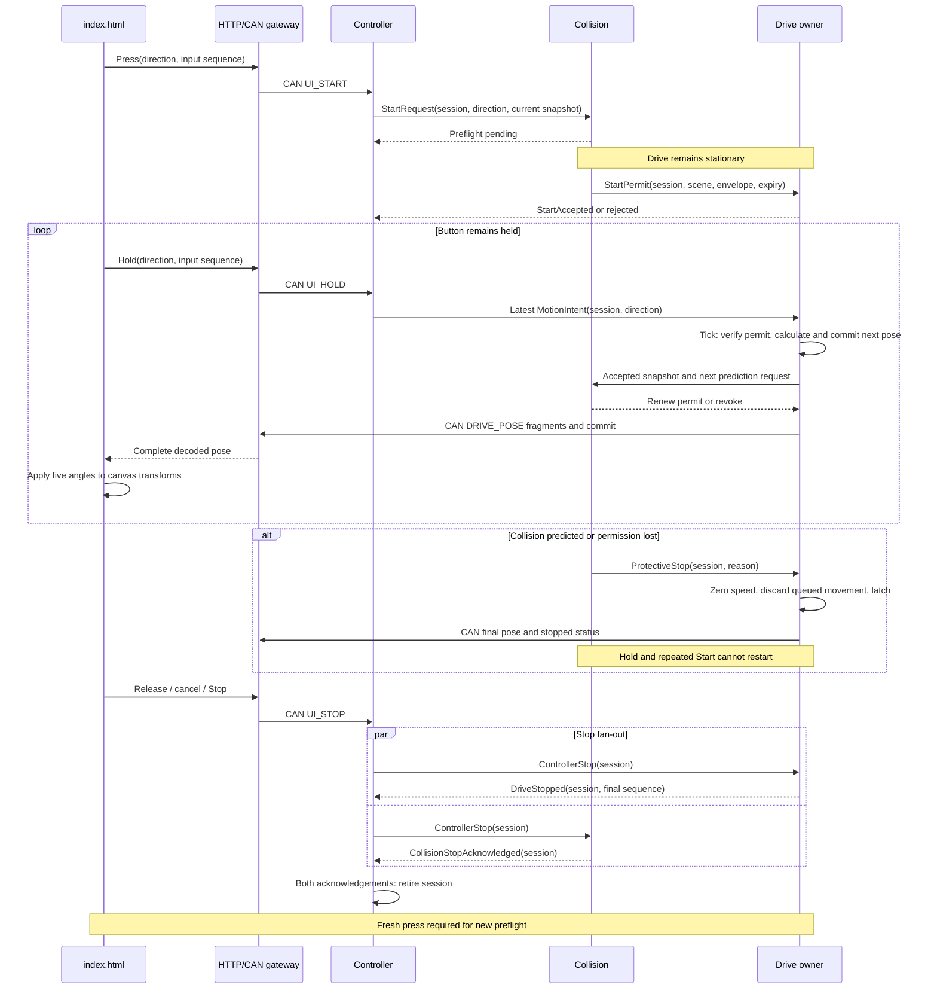

# Predictive collision avoidance for RTMC-System

Design revision 3 — 2026-09-14. Repository baseline: `ee5ef8e0e3a7f57d11cf8d8620aa985ed9a36690`.

**Revision 4 — 2026-09-15:** [Head-side C-arm, angular limits and clearance redesign](head-side-clearance-design.md) analyses the four reported issues and specifies the implemented simulation geometry, predictive avoidance changes, runtime integration and acceptance tests. Physical calibration and release evidence remain open.

**Revision 3 workflow implementation:** [Section 18](#18-integrated-joystick-c-arm-display-and-can-workflow) specifies the single-page C-arm display and controller/collision/drive CAN workflow. The simulator implements the integrated canvas, versioned UI commands, coherent drive CAN feedback and predictive stop lifecycle. Section 18.2 records the exact simulation boundary and section 18.12 defines the continuing acceptance gate.

**Deliverable status:** implementation architecture, a reproducible synthetic 3D reference dataset, and a C++ simulation implementation under `collision/`. The application now uses asynchronous preflight, predictive permits and a latched avoidance stop. This is not a released physical safety function: machine dimensions, calibration, measured feedback, backend command acknowledgement, dynamics and stopping performance remain unverified.

## 1. Purpose and scope

Prevent a moving positioner from contacting the fixed patient table, equipment, its own non-adjacent parts, or configured patient/accessory exclusion volumes. Evaluate the future occupied space of **every moving body**, including the end effector (EOF), during continued movement and braking. A free next position alone does not establish that movement is safe.

The controller requests motion with a direction. An asynchronous preflight check must authorize the initial movement before the actuator receives a movement command. Thereafter a collision worker runs independently of the drive. The drive performs only bounded permission and fault checks on its command path. If a future movement cannot be certified clear with enough room to stop, request a protective stop immediately. Hold the stopped state until a controller Stop acknowledges that motion session; never resume because the obstacle disappears or because the button remains held.

This version avoids collision by withholding movement and stopping. It does not steer around an obstacle, reverse automatically, or silently change the requested heading. Route planning and automatic speed optimization are future features with separate validation.

“Static” describes an object's world pose, not its mesh file. Robot geometry is normally rigid and preloaded but its pose is dynamic. A fixed table is static only while its installation and attachments remain unchanged. Patients, staff, drapes and loose cables cannot be assumed static during clinical motion. A synthetic patient box is a test obstacle, not a patient sensing system.

## 2. Original baseline and integration gaps

The table records the original baseline; several software gaps are now implemented. Section 17 and implementation.md define the current five-axis simulator and mandatory completion gate. Hardware-only gaps remain open.

| Existing location | Observed behavior | Required extension before avoidance can govern motion |
| --- | --- | --- |
| `drive/include/cDriveCalculator.h` | L1=75 cm, L2=100 cm; base=(-25,0) cm; A2 relative to A1 | Retain planar FK; add calibrated body transforms and unit adapters |
| `includes/commonDrive.h` | 50 ms integration step; 20 cm/s Cartesian command; 60 deg/s joint limit; 120 deg/s² profile ramp | Separate command limits from measured velocity, acceleration and guaranteed braking capability |
| `drive/src/cDriveCalculator.cpp` | Endpoint feasibility and per-tick joint-step budget | Pure trajectory proposal plus continuous path and stopping-envelope verification |
| `drive/src/cDriveController.cpp` | `StartDrive` sets speed and immediately calls `HandleJoystick` | Replace with pending preflight; no initial movement before permission |
| Same controller | `HandleJoystick` has e-stop/error checks but no running-state gate | Add explicit state machine and permission gate for every movement command |
| Same controller | `StopDrive` resets software profile and writes zero speed | Define actuator protective stop, queue cancellation and measured stop completion |
| `SystemController/src/cControlManager.cpp` | DRIVE callback goes straight to `iDrive::HandleJoystick` | Publish intents to the drive owner; collision worker must not mutate drive state |
| `CANMocker/src/cCANMocker.cpp` | Every Start uses payload `0x01`, decoded as +X, even when another button was selected | Start must carry the actual direction and session/command sequence |
| `PCAN/src/cPCANController.cpp` | Four axis targets sent as four frames; no common sequence/commit handshake | Add coherent trajectory commit or include axis start skew in prediction |
| `includes/iPCANController.h` | No measured joint feedback, stop acknowledgement or watchdog contract | Extend transport behind a motion backend interface |
| PCAN and HTTP mocker | Synchronous callbacks, stubbed transmission, console logging | Separate input, periodic drive, prediction and diagnostic scheduling |

The stored current position is a commanded position. Existing kinematic tests establish mathematical consistency, not that physical axes occupy that position. The scalar profile ramp constrains step size; it does not prove signed per-axis acceleration, jerk, reversal dynamics or physical deceleration. Do not substitute `JOINT_ACCEL_DPSS` for a measured braking bound.

The repository documents rotation about world Z. The new 3D world therefore uses X/Y horizontally and Z upward, despite the legacy `drivePosition.Y` comment saying “vertical coordinate.” Preserve numeric X/Y behavior and resolve physical axis conventions during calibration.

## 3. Requirements and invariants

| ID | Requirement |
| --- | --- |
| CA-01 | No movement on Start until the actual starting direction and a finite initial trajectory have a valid permission |
| CA-02 | Collision computation never waits on the drive path; drive checks have bounded execution |
| CA-03 | Every issued segment has certified occupied-space coverage through its latest possible stop |
| CA-04 | Prediction uses velocity, direction, possible acceleration, braking behavior, body size and EOF geometry |
| CA-05 | Hazard, stale result or unknown geometry revokes movement and initiates braking without waiting for controller Stop |
| CA-06 | Protective stop remains latched until a Stop for the affected session and verified standstill; a new Start requires fresh preflight |
| CA-07 | Late SAFE results, duplicate Start, held direction and old sessions cannot clear a stop latch |
| CA-08 | All robot–environment and relevant robot–robot pairs are covered, including A4/A5 rotation with unchanged EOF X/Y |
| CA-09 | Geometry/model changes invalidate permissions atomically; no object disappears during static/dynamic migration |
| CA-10 | Missing feedback, invalid numbers, solver exhaustion, queue overflow and deadline failure never produce CLEAR |
| CA-11 | Transport stop latency, queued commands, actuator response and stopping distance are included in the safety budget |
| CA-12 | Physical release requires measured models and stopping tests; the supplied synthetic data cannot authorize hardware |

Core invariant: from every allowed command state, the complete certified fallback stop remains collision-free under the declared uncertainty bounds. The worker renews permission before expiry. The drive can consume a previously certified segment without waiting; it cannot continue indefinitely on the last CLEAR result.

## 4. Components and execution model



The implemented module `collision/` contains `cSceneRegistry`, `cBodyKinematics`, `cTrajectoryPredictor`, `cProximityBackend`, `cCollisionSupervisor` and the bounded `cSpscMailbox`. `includes/iCollisionSupervisor.h` is the drive-facing supervision contract. The current simulator still uses `iPCANController`; the planned `iMotionBackend` feedback, atomic trajectory commit, stop acknowledgement and watchdog contract remains future hardware work.

| Execution context | Ownership and allowed work |
| --- | --- |
| Input receiver | Decode and validate inputs, publish intent; never integrate position or run geometry |
| Drive owner | Sole writer of lifecycle state, command sequence, profile and backend output; periodic execution independent of browser events |
| Collision worker | Owns proximity objects/caches, reads snapshots, builds predictions, publishes permissions or revocation |
| Feedback receiver | Publishes complete timestamped axis samples; never expose a half-updated pose |
| Model loader | Validates geometry offline, builds indexes, stages new immutable scene generation |
| Diagnostic worker | Serializes records and UI status outside drive/collision deadlines |
| Backend watchdog | Stops on missed command heartbeat even if the drive process stalls |

Use preallocated bounded single-producer/single-consumer queues at each ownership boundary. Multiple input producers require a dedicated consolidator or a verified bounded multi-producer queue. Use fixed-size value copies with acquire/release publication and explicit slot ownership. A plain two-buffer pointer swap is insufficient if a writer reuses a slot while the reader is copying it; likewise a seqlock over non-atomic C++ fields can have undefined data races. Choose a proven C++17 implementation and test slot reuse. Avoid real-time `shared_ptr` reclamation, allocation, file I/O, unbounded retries and blocking mutexes.

Protective-stop publication is a separate sticky atomic flag plus session epoch. It cannot be lost behind ordinary queue traffic. If an inbox or permit queue fills, preserve Stop/revocation and deny further motion; diagnostics may drop messages with a counter. Retire geometry generations off the drive thread after readers release them. Startup publishes no valid permission; shutdown requests stop, verifies standstill or invokes the independent stop path, then joins workers and releases transport.

“Non-blocking” means computational independence, not immediate start despite a pending check. The Start API returns `PendingPreflight`; the actuator remains stationary until the worker grants movement.

## 5. Motion lifecycle and signal ordering

| State | Event / condition | Action and next state |
| --- | --- | --- |
| DISARMED | New valid Start with nonzero actual direction, fresh feedback and scene | Create session; retain standstill; PREFLIGHT |
| DISARMED | Direction without Start | Ignore movement; record invalid lifecycle input |
| PREFLIGHT | Matching unexpired permission and actual state inside certified initial bounds | Commit first certified segment; RUNNING |
| PREFLIGHT | Hazard, unknown result, deadline or invalid input | Revoke; latch denial; AVOIDANCE_LATCHED (already stationary) |
| PREFLIGHT | Controller Stop | Cancel epoch; DISARMED; late permission is unusable |
| RUNNING | Valid matching permission for next segment | Commit within permitted time and state bounds; stay RUNNING |
| RUNNING | Collision predicted, permission expiry, scene change, feedback failure | Revoke; flush future targets; request coordinated protective stop; BRAKING |
| RUNNING | Controller Stop | Cancel motion; execute certified stop; BRAKING with controller acknowledgement recorded |
| BRAKING | Fresh measured standstill for configured dwell and stop acknowledged | AVOIDANCE_LATCHED if controller acknowledgement missing; otherwise DISARMED if faults permit |
| BRAKING | Stop missed its deadline, tracking escapes bound or backend fails | Escalate to independently engineered stop; FAULT_LATCHED |
| AVOIDANCE_LATCHED | Matching controller Stop after session began, verified standstill, no unresolved fault | Acknowledge session; DISARMED |
| AVOIDANCE_LATCHED | Direction, duplicate Start, obstacle clears, late CLEAR | Stay latched; no movement |
| FAULT_LATCHED | Controller Stop | Acknowledge request only; fault recovery/service procedure still required |
| Any | Emergency stop | Emergency function dominates; invalidate epoch and permits |

A Stop received while braking is remembered; the user need not release twice. Stop must match the active session, or be an explicitly global stop. A stale Stop from a previous session cannot acknowledge the current latch. New Start must be a new edge/session after Stop; continuously repeated Start frames cannot rearm motion. Communication loss while a button is held expires its command lease and triggers stop even if no release frame arrives.

Direction reversal or a speed increase outside the current permission invalidates that permission. Version 1 stops and performs a new preflight before accepting such a change. Supporting continuous direction changes later requires certifying the transition from the existing velocity, not assuming that the new direction takes effect instantly.

```text
Controller:  Start(direction, session) ----- held direction ----- Stop ----- new Start
Drive:       PREFLIGHT -> RUNNING ---------- BRAKING -> LATCHED -> DISARMED -> PREFLIGHT
Worker:      certify ----- renew ----- predicted hazard / revoke
Actuator:    stationary -> commanded motion -> braking -> stationary
                                      ^ stop requested here; never wait for controller Stop
```

## 6. Predictive stopping model

### 6.1 Inputs and uncertainty

Each coherent motion snapshot contains measured `q`, bounded `qdot` and `qddot`, sample timestamps, tracking-error bounds, commanded trajectory and queued segments, drive mode, payload/brake profile identifier, intent/session sequence and scene generation. Use monotonic time for deadlines. Encoder position alone does not yield trustworthy instantaneous velocity; use measured velocity or a bounded estimator whose delay/error is included.

Model the current sample's age, axis sample skew and command/feedback clock alignment. Invalid bounds, NaN, infinity, position discontinuity, unknown brake profile or zero guaranteed deceleration produce UNKNOWN. Unknown must inhibit starting or initiate the certified fallback while moving.

### 6.2 Reaction interval and horizon

For a sample timestamp `t_s`, certify the allowed continuation until the permission's latest allowed commit/expiry, plus all stop-request and actuator delays, then the full brake trajectory. Account for a permitted segment's duration and any uncancellable queued commands. There must be no uncovered interval between successive permissions.

For a conservative end-to-end budget define:

`T_react = T_sample_age + T_monitor_gap + T_compute + T_publish + T_drive_dispatch + T_bus_queue + T_actuator_response`.

These terms must be disjoint measured worst-case bounds; do not double-count overlapping work or substitute average latency. Permission expiry must force a stop no later than the reaction interval already certified. If permission duration or buffered motion exceeds this budget, extend the certified horizon accordingly or shorten permission.

`H >= T_react + T_brake_max + T_settle_guard`.

Never authorize motion just because an obstacle lies beyond a fixed lookahead. If the required stopping horizon exceeds the available prediction horizon, stop or refuse the request.

### 6.3 Scalar example for intuition and test oracles

For a body point traveling toward a plane, let current closing speed be `v >= 0`, maximum possible acceleration toward it during reaction be `a_plus >= 0`, guaranteed braking magnitude be `b_min > 0`, and geometric/measurement margin be `M`:

```text
v_react = v + a_plus * T_react
d_react = v * T_react + 0.5 * a_plus * T_react²
d_brake = v_react² / (2 * b_min)
d_required = d_react + d_brake + M
t_brake = v_react / b_min
```

Illustrative only: `v=0.20 m/s`, `a_plus=0.40 m/s²`, `T_react=0.080 s`, `b_min=0.50 m/s²`, `M=0.020 m` gives `v_react=0.232 m/s`, `d_react=0.01728 m`, `d_brake=0.053824 m`, and `d_required=0.091104 m` (91.104 mm). Stopping time after brake onset is 0.464 s. None of those braking/margin values are machine specifications.

The formula assumes constant immediate deceleration after reaction. Jerk-limited braking, actuator lag, gravity, load, compliance, brake engagement and torque saturation require a measured bound or a piecewise dynamic model. Use per-axis validated stop profiles over direction, configuration, load, temperature and supply conditions. No favorable averaging across test runs.

### 6.4 Whole-body motion

For every local body point `p`, compute `p_world(t)=T_world_body(q(t))*p`. A useful conservative speed bound is the sum of each upstream joint's `|qdot_j| * r_j_max` plus translational joint speeds; use the maximum lever arms over the interval. Acceleration includes angular acceleration and centripetal terms. Body-point Jacobians may tighten the bound but a bound evaluated at just one pose does not cover changing lever arms.

EOF translation can be almost zero while the elbow, C-arm rim or detector moves rapidly. At 60 deg/s, a point 0.8 m from a rotation axis already has about 0.838 m/s tangential speed for that joint alone. Current Cartesian command speed is therefore not an upper bound on every surface speed.

Generate a reachable tube that includes allowed nominal execution, uncertainty, and stopping initiated at **any possible time during the permit interval**. Checking only a single nominal stop at the end can miss a different earlier braking path when axes decelerate asynchronously. Certify coordinated braking or bound all admitted per-axis timing variations. Also check mechanical limits through the entire stop, not only the commanded endpoint.

## 7. Geometry algorithm selection

| Stage | Selected approach | Correctness and performance contract |
| --- | --- | --- |
| Scene indexing | Prebuilt static AABB BVH; updated dynamic AABB tree for articulated bodies | Objects use stable IDs; same geometry representation in both indexes |
| Candidate generation | Swept, margin-expanded AABBs over the entire reachable tube | Rotation and acceleration included; union of endpoint AABBs alone is insufficient |
| Simple-body distance | Analytic primitive distance where supported; box SAT for overlap and GJK for convex distance | Double precision; bounded iterations; report UNKNOWN separately from CLEAR |
| Complex C-arm | Compound convex parts, optionally refined with validated mesh BVH distance | Preserve opening; a single convex hull fills the C opening and creates excessive false stops |
| Continuous coverage | Conservative advancement or adaptive interval enclosure along actual joint-space trajectories | Every interval certified; no reliance on sparse pose sampling |
| Contact diagnostics | Optional EPA / contact details after overlap | Not needed to permit movement; penetration estimation is not collision prevention |

FCL is a candidate behind `iProximityBackend`: its primary documentation describes distance, collision and continuous queries plus primitive/mesh support. Pin an audited revision and solver configuration after supported shape-pair and motion tests. An API named continuous collision does not establish coverage of RTMC's accelerating articulated path; endpoint rigid-transform interpolation may follow a different path. [FCL documentation](https://github.com/flexible-collision-library/fcl).

For adaptive interval checking, calculate a lower bound on separation `d_lower` at a reference instant and an upper bound `D_move` on relative surface displacement across the interval. The interval is clear only if `d_lower - D_move > M_pair`. Otherwise subdivide or run a supported continuous solver. `d_lower` must include numerical error; do not treat an unconverged GJK estimate as a lower bound. On time/iteration/subdivision exhaustion return UNKNOWN and stop. No epsilon may shrink a forbidden envelope.

A box or convex proxy can establish clearance only when it encloses the actual geometry with a documented error bound. If overlapping proxies are refined, the refined geometry must retain validated enclosure and uncertainty coverage; a decorative mesh cannot override a conservative collision result. Mesh surface intersections alone also miss one closed solid fully inside another; include containment semantics or use conservative volumetric convex geometry.

Warm-start pair caches, nearest-pair prioritization, staged resolution and branch pruning improve speed. Never skip pairs merely because they were distant last cycle. Prototype broad-phase completeness against brute-force all-pair checks. For this modest body count, benchmark brute force too; a tree is useful only if its measured worst-case cost justifies its complexity.

## 8. Drive permission contract

```cpp
// Proposed contract, not production code. Use fixed-capacity storage.
struct MotionSnapshot {
    uint64_t session, command_sequence, state_sequence, scene_generation;
    MonotonicTime sampled_at;
    JointState measured;       // q, qdot, qddot bounds in SI
    TrackingBounds tracking;
    PendingTrajectory queued;
    MotionIntent intent;
    BrakeProfileId brake_profile;
};
struct MotionPermit {
    uint64_t session, command_sequence, scene_generation, stop_epoch;
    uint64_t segment_sequence;
    MonotonicTime earliest_commit, latest_commit, expiry;
    StateBounds admissible_start;
    CertifiedSegment segment;
    StopEnvelopeId fallback;
    ClearanceLowerBound minimum_clearance;
};
enum class Prediction { Clear, Hazard, Unknown };
```

The drive accepts a permit only if session/intent/scene/epoch match, time is valid, measured state remains inside the certified start set, no stop flag is set, and the exact segment is the one being sent. The segment's scheduled start must match the certified timing. A verdict that only says “next position clear” is not a permit. Worker and drive share a deterministic, side-effect-free trajectory generator; they must not call the same mutable `cDriveCalculator` concurrently.

Publish a preflight request as soon as Start is accepted; do not wait for a first movement command to create the worker's input. Maintain a finite pipeline of certified segments, with each sequence consumed at most once. While a committed segment executes, drive ticks monitor its state bounds and stop conditions without retransmitting it as a new segment. Renewal must be ready by the next segment boundary; loss of renewal invokes the already certified stop. A future bundle of segments may be published together only if the permission covers their complete execution and stopping envelope.

The final gate sits immediately before transport commit. Revocation racing with a commit may permit at most the documented in-flight command; that command and its delay must already be included in the stopping envelope. Backend sequence cancellation and command expiry prevent old targets executing after the stop. A check of an atomic boolean cannot retract a command already accepted by a motor.

```text
drive_tick:
  read coherent feedback and lifecycle events using bounded operations
  if stop/fault/feedback invalid: revoke; issue idempotent stop; return
  if state is not PREFLIGHT or RUNNING: do not issue movement; return
  publish current snapshot / pending trajectory request without waiting
  if PREFLIGHT and result still pending before preflight deadline: remain still; return
  if a committed segment is still executing within permission bounds: monitor; return
  read available permit without waiting
  if permit mismatches time/state/intent/scene: revoke; stop if moving; return
  commit exactly the certified segment with its sequence and expiry
  mark segment consumed; next tick publishes updated execution state

collision_cycle:
  read newest complete snapshot and matching immutable scene
  if invalid: publish sticky revoke with reason; return
  build candidate continuation and all allowed fallback stop motion
  compute conservative swept bounds; enumerate all relevant body pairs
  certify every interval against pair-specific margins within deadline
  if every pair is CLEAR: publish finite permit
  otherwise: publish sticky revoke; emit Hazard or Unknown diagnostic
```

The backend must distinguish “stop request accepted,” “braking underway” and “measured standstill.” Zero speed written to CAN is not a standstill acknowledgement. Standstill requires all relevant measured joint speeds below configured thresholds for a dwell interval, fresh samples, no continuing position drift outside the bound, and brake/hold status as applicable. Keep monitoring throughout braking.

## 9. Timing and capacity design targets

The following are original future scheduling targets, not the implemented timing configuration. Revision 2 currently uses the 50 ms input cadence, 150 ms renewal deadline, and 250 ms conservative reaction allowance documented in section 17. The future allocations below require a dedicated periodic motion owner before they can be claimed:

| Budget item | Candidate upper allocation |
| --- | ---: |
| Feedback age / acquisition skew | 10 ms |
| Gap until next collision evaluation | 10 ms |
| Collision computation | 5 ms |
| Result publication | 1 ms |
| Drive gate/dispatch | 5 ms |
| Transport queue and stop delivery | 9 ms |
| Actuator response before guaranteed braking | 40 ms |
| Total reaction budget | 80 ms |

Drive target period is 5 ms; collision release period is 10 ms with a 5 ms computation deadline. UI may remain 50 ms because it publishes intent rather than integrating motion. Keeping the existing 50 ms drive dispatch increases this example's reaction budget to 125 ms; recompute all envelopes. A permit may allow at most 10 ms of future continuation, and its timing must be proven consistent with these allocations. Measured scheduler jitter must fit within allocations or enlarge them explicitly.

Preallocate capacities for body count, convex parts, candidate pairs, trajectory intervals and event queues at scene load. Reject an oversized scene before activation. Fixed-capacity exhaustion during prediction gives UNKNOWN. Benchmark near-contact dense scenes, coincident faces, maximum axes moving, cold caches and model transition, not only average operation. Record maximum response latency and deadline misses on target hardware; percentile latency alone does not demonstrate a worst-case bound.

## 10. 3D reference data and coordinate contract

The accompanying [data specification](data-specification.md) defines the delivered files, dimensions, transform equations and replacement procedure. [Model parameters](../../data/collision/reference/parameters.json) are the editable source; generated files live under `data/collision/reference/generated/`.

Use meters, radians and seconds internally. Legacy centimeters and degrees convert once at the adapter boundary. World frame W is right-handed with Z up, X along the declared EOF travel, Y across it. W=(0,0,0) is the floor point below the closed-pose EOF, not the base axle. The base's planar offset stays (-0.25,0) m.

Preserve A1 in [-180,10] degrees and A2 in [0,180]; A3/A4 use [-180,180] and A5 uses [-90,90] degrees as current assumed software limits. Heights, solid cross-sections, A3/A4 axis placement and housing dimensions are explicit simulation assumptions. Revision 4 uses `Rz(A1+A2+A3) * Rx(A4) * Ry(A5)` for the C-arm, with `A3=-(A1+A2)`, at the EOF X/Y and an assumed isocenter height. The non-tilting rear support additionally uses fixed `Rz(-90°)` to extend toward patient −X. Actual LAO/CRAN axes and offsets remain a release blocker, not inferred facts.

ARTIS pheno contributes only the robotic C-arm reference concept, 1.30 m maximum source-to-image distance and 0.955 m usable clearance. Those are reference-product specifications, not complete collision geometry. The detector's published active field is not its external housing size. Our two-link/five-axis robot and fixed table deliberately differ from the manufacturer's mechanism and multi-tilt table. [Siemens ARTIS pheno specifications](https://www.siemens-healthineers.com/angio/artis-interventional-angiography-systems/artis-pheno), [Siemens system overview](https://academy.siemens-healthineers.com/_/en-us/artis-pheno-system-overview-us/).

No OEM CAD, manufacturer-specific enclosure accuracy, purchased table model or physical patient scan is claimed. The dataset is marked `simulation_only`; production loading must reject it regardless of whether an individual preview looks clear.

## 11. Static/dynamic model evolution

Separate immutable `GeometryAsset` from `SceneObject` pose/mobility and from `MotionSource`. A rigid robot body uses joint kinematics; fixed installation uses a calibrated constant pose; tracked equipment later supplies timestamped pose and bounded future motion. All use the same proximity API.

Maintain static–dynamic and dynamic–dynamic queries, plus initialization validation of static–static configuration. A fixed-base robot's links always belong to the dynamic index even while stopped. Same rigid-body internal parts may be excluded; adjacent joints require reviewed local contact regions, not blanket link exclusions. Keep the rest of each adjacent pair eligible for self-collision testing.

For version 1, migrate a static obstacle to dynamic only at verified standstill: build a complete new generation off-thread; validate all objects/frames and the motion source; atomically activate generation; invalidate cached permits; perform new preflight. Keep the old scene active until the complete replacement is ready. A future live migration must conservatively cover old and new occupied sets and tracking uncertainty throughout handover.

Tracked objects require maximum age, calibration, velocity/acceleration bounds and uncertainty growth with prediction time. Loss or occlusion does not remove the object. Retain a conservative reachable region or stop if its movement cannot be bounded. Deformable patient motion and cables require their own envelope/sensing model; switching an enum cannot supply that information.

## 12. Failure modes and recovery

| Failure / bottleneck | Response or mitigation | Required evidence |
| --- | --- | --- |
| Collision worker hangs | Permit expires; drive stops; independent backend watchdog covers drive failure | Inject worker and full-process stalls |
| Solver runs long near contact | Bound iterations and intervals; UNKNOWN prevents renewal | Adversarial near-parallel/contact cases |
| Coarse proxies cause frequent stops | Tighter validated convex decomposition; refine only within enclosure/error contract | False-stop measurements and enclosure tests |
| Excess pair count | BVH, conservative swept pruning, warm starts; capacity gate | Brute-force oracle plus worst-case benchmark |
| Scene/feedback unit or frame mismatch | Reject metadata mismatch; calibrated marker checks | cm/m, deg/rad, handedness fault injection |
| Sequential axis delivery alters path | Atomic sequence commit or bounded axis skew in reachable tube | Bus delay/reorder/drop tests |
| Drive brake slower under load | Conservative load/configuration braking profile | Measured worst-case stopping trials |
| Stale SAFE arrives after Stop | Epoch/sequence validation; sticky latch | Event permutation tests |
| Stop command cannot be delivered | Independent stop/watchdog function; fault latch | Cable loss and bus saturation trials |
| Abrupt torque removal permits sag | Engineer gravity-safe braking/hold; do not assume power removal is safe | Mechanical/drive failure analysis |
| Patient/accessory outside model | Presence sensing or controlled exclusion volume with uncertainty | Setup validation and tracking-loss tests |
| Startup already intersects obstacle | Inhibit standard movement; diagnosed service recovery only | Overlap/containment fixtures |

The exact independent protective-stop mechanism must follow the machine's drive and mechanical design. Emergency stop remains distinct from normal predictive protective stopping. Recovery movement from an invalid/overlapping pose needs a separately reviewed mode; it is not authorized by reversing the joystick in the normal state machine.

## 13. Verification and acceptance matrix

Existing `tests/test_kinematics.cpp` remains the planar regression suite. Add future tests below with a virtual monotonic clock, fake backend, delayed feedback and controlled worker scheduling.

| Test ID | Scenario and acceptance |
| --- | --- |
| AVOID-01 | Each of eight Start directions preserves actual intent; denied Start emits no movement target |
| AVOID-02 | Drive tick remains bounded while worker sleeps indefinitely; missing permission stops before certified expiry |
| AVOID-03 | Next pose clear but brake trajectory intersects table: deny/stop before unsafe continuation |
| AVOID-04 | Obstacle between clear endpoints: continuous check finds it |
| AVOID-05 | Pure A4/A5 rotation, stationary EOF, detector rim approaches table: stop predicted |
| AVOID-06 | A1/A2 elbow sweep hits obstacle while EOF remains clear: stop predicted |
| AVOID-07 | Hazard clears while button held: no restart; Stop then fresh Start required |
| AVOID-08 | Stop arrives during braking: acknowledgement remembered; still wait for measured standstill |
| AVOID-09 | Late permit, duplicate Start, reordered Stop, old scene or wrong session: cannot authorize movement |
| AVOID-10 | NaN, timestamp jump, stale feedback, unknown brake profile, overflow or solver exhaustion: UNKNOWN |
| AVOID-11 | Command queued across revocation: cancel/reject stale sequence; in-flight movement inside certified tube |
| AVOID-12 | Delayed and asynchronous per-axis brakes: every admitted stop path remains clear |
| AVOID-13 | Static/dynamic generation change: no missing object and no permission survives transition |
| AVOID-14 | Near-touching, contained solids, thin obstacles and nearly parallel faces: no false CLEAR |
| AVOID-15 | Broad-phase candidates versus brute-force swept oracle: no missing potentially colliding pair |
| AVOID-16 | Braking distance plane fixture reproduces 91.104 mm example; no acceleration/brake-limit substitution |
| AVOID-17 | Home/extended and rotated frame transforms preserve repository planar FK and relative A2 |
| AVOID-18 | Stop path crosses joint limit or prediction horizon too short: movement refused |
| AVOID-19 | Synthetic or uncalibrated asset in hardware mode: load denied |
| AVOID-20 | Hardware trials across speed, direction, load and joint configurations: measured swept motion stays inside certified bounds and retains required clearance |

Property checks: increasing uncertainty, reaction latency or maximum approach acceleration must not make a previously denied case clear; decreasing guaranteed braking cannot reduce stopping requirements. Compare geometry against independent analytic fixtures and dense numerical sampling as a regression oracle, while recognizing sampling itself is not continuous proof. Race detection and adversarial event schedules supplement state-machine tests.

Release gates: (G1) measured geometry and transform enclosure; (G2) pure trajectory agreement with backend interpolation; (G3) software lifecycle/permission fault tests; (G4) measured timing and stopping bounds; (G5) integrated hardware evidence with independent protective measures. Passing current artifact checks establishes none of G2–G5.

## 14. Ordered implementation work packages

| Package | Work and outputs | Exit gate / dependency |
| --- | --- | --- |
| WP0: machine contract | Measure A3/A4 frames, link solids, table and accessories; define backend interpolation, feedback, brake/hold behavior | Signed calibration and uncertainty register; required for physical use |
| WP1: deterministic motion owner | Preserve Start direction; implement states, event sequencing, periodic loop and pure trajectory proposal | AVOID-01/07/08/09; existing kinematic regression |
| WP2: geometry and static scenes | SI adapter, body transforms, validated loader, compound primitives, static index | AVOID-14/15/17/19; simulation may use supplied dataset |
| WP3: prediction and stop envelope | Bounded velocity/acceleration state, delay/queue model, whole-body continuous checks | AVOID-03/04/05/06/12/16/18 |
| WP4: asynchronous supervision | Bounded mailboxes, exact segment permits, expiry/revocation, worker deadlines | AVOID-02/09/10/11; concurrency and timing evidence |
| WP5: backend and hardware | Feedback, coherent commit, priority stop/cancel, watchdog and measured standstill | AVOID-11/12/20; G4/G5 |
| WP6: dynamic obstacles | Motion-source adapter, uncertainty propagation and atomic scene migration | AVOID-13 plus stale/occluded tracking tests |

WP1 and WP2 can proceed independently; WP3 needs their contracts. WP4 integrates WP3; WP5 determines the numerical bounds used for physical release. WP6 extends object motion without replacing geometry or the permission contract. Do not wire a partial geometry check into the existing Start path and describe it as completed avoidance.

## 15. Design decisions requiring machine evidence

| Open item | Current working choice | Evidence needed |
| --- | --- | --- |
| EOF meaning | End effector, following repository kinematics document | Confirm actual attached assembly and relevant accessories |
| Fixed patient table | Floor-fixed synthetic table; no table joints | Actual CAD, installed pose and deflection/load envelope |
| A3/A4 transforms | Compensated Z heading, then intrinsic Y (A4) and X (A5) | Mechanical drawings, encoder sign/zero calibration |
| Arm height separation | Two horizontal links at different heights | Physical link housings, bearings and joint geometry |
| Actual braking | No released profile | Direction/load/configuration trials and worst-case latency |
| Stop acknowledgement | Session Stop plus measured standstill | Controller protocol and required operator indication |
| Initial timing | 80 ms illustrative reaction budget | Target scheduler, CAN and actuator measurements |
| Patient/staff coverage | No real-time sensing in current repository | Intended scope and sensing/controlled-space design |

These unknowns do not prevent simulation implementation, but the software must expose them as unvalidated and refuse hardware authorization.

## 16. Source and safety-process context

The algorithm and concurrency decisions above are engineering proposals, not requirements quoted from a standard. Applicable device risk management includes [ISO 14971:2019](https://www.iso.org/standard/72704.html). Medical electrical basic safety and essential performance are addressed by [IEC 60601-1](https://webstore.iec.ch/en/publication/67497); interventional X-ray equipment has particular requirements under [IEC 60601-2-43:2022, FDA recognition](https://www.accessdata.fda.gov/scripts/cdrh/cfdocs/cfStandards/detail.cfm?standard__identification_no=44449). Software lifecycle planning should assess [IEC 62304](https://webstore.iec.ch/en/publication/6792) and applicable amendments/market recognition. Applicability, classification and residual risk require device-specific review; none of these sources certifies the proposed algorithm or synthetic model.

Primary sources were consulted on 2026-09-14. Source product dimensions are distinguished from RTMC constants and synthetic assumptions in the data package. Manufacturer transport dimensions are not used as collision envelopes.

## 17. Five-axis head reference and live runtime completion

This section is the revision-2 implementation contract. The three requested
improvements are complete only when coordinate, runtime, and display checks all
pass against the same built application and generated scene.

### 17.1 Fixed patient frame and pivot contract

Define the patient frame once at startup. The head center is H=(0,0,1.20) m in
the synthetic world. +X follows the fixed table from head toward feet, +Y is
transverse, and +Z points upward. Legacy drive X/Y remain centimeters, reported
as offsets from that fixed initial head projection; angles remain degrees at
the drive interface. The head is not re-zeroed after motion or Stop.

A1 and A2 retain their lengths, limits, positive-elbow IK branch, relative-A2
convention, and base (-0.25,0) m. A3 is a rotary alignment joint at the end of
link 2. Its Z axis is parallel to those of A1 and A2. Those three joints do
not share one spatial center: making them concentric would change the existing
2R mechanism. The A3 mount pivot is (F.x,F.y,0.68) m in this synthetic assembly.

| Axle | Function | Command |
| --- | --- | --- |
| A1 | Base rotation around Z | Existing planar IK |
| A2 | Relative elbow around Z | Existing planar IK |
| A3 | Support/C-arm heading compensation around Z | -(A1+A2), automatically derived |
| A4 | LAO/RAO about local Y at imaging center | Requested LAO |
| A5 | CRAN/CAUD about subsequent local X at imaging center | Requested CRAN |

The A4/A5 axis names and rotation order are explicit simulation conventions;
physical anatomical signs and bearing offsets require mechanical confirmation.

For angular values in radians and all positions in meters:

```text
E = (-0.25,0) + 0.75 * [cos(q1), sin(q1)]
F = E + 1.00 * [cos(q1+q2), sin(q1+q2)]
q3 = -(q1+q2)
I = (F.x,F.y,1.20)
T_support = Translation(F.x,F.y,0.68) * Rz(q1+q2+q3)
T_carm = Translation(I) * Rz(q1+q2+q3) * Ry(q4) * Rx(q5)
```

Consequently Rz(q1+q2+q3)=identity in commanded motion. X/Y always follow the
patient frame even after LAO/CRAN rotation. Pure A4/A5 changes preserve I.
At X=Y=0, I=H. After translation, rotation is about the new imaging location,
while the original head coordinate reference stays fixed.

All five angles participate in per-tick rate and travel checks. A3 is not
normalized with an angle wrap that could introduce a discontinuous command.
CAN targets are 0x201=A1, 0x202=A2, 0x203=A3 alignment, 0x204=A4 LAO,
0x205=A5 CRAN. This is a protocol revision: an old four-axis controller must
not consume the new layout. There is still no physical multi-frame commit
acknowledgement in the simulator.

### 17.2 Geometry ownership and collision consequences

The torso and the new head primitive are fixed obstacles. The patient head
primitive is centered exactly at H; the table and mattress remain fixed.
A3 rotates the support frame independently from link 2, so its rigid-body ID
is `alignment`, not `link2`. The C-arm, detector and source share `carm`.

Runtime and viewer apply the same five-angle transform. Swept bounds include
interval bounds on planar joint excursions (including interior extrema), plus
body-center offset and half-diagonal, ensuring a box centered on the pivot
still has a nonzero rotational surface sweep. A4/A5 changes must trigger
prediction even when X/Y do not change. A3 compensation does not remove A1/A2
link motion from collision checks.

The retained synthetic interface exclusions are link1/link2,
link2/alignment, alignment/carm and legacy link2/carm. This accommodates the
existing overlapping proxy housings; it is not a verified local contact-mask
model. The scene has no independent bearing CAD. Measured geometry and reviewed
local masks are required before claims about physical self-collision protection.

### 17.3 Running application and display data flow



One `pcan_demo` process serves the dashboard, viewer and state API on
`http://localhost:8082`. Startup fails if assets are absent, collision workers
cannot initialize, or the server cannot bind. There is no detached Python web
server or fixed devcontainer path. CMake records the source asset root; a
relocated binary can use `--assets /absolute/path/to/RTMC-System`.

The HTTP server owns command callbacks serially. The drive admits at most one movement per 50 ms, so a burst of packets cannot accelerate the simulated motion clock. Browser presses send Start
with the actual selected direction; ordered continuation requests follow every
50 ms. Release, pointer cancellation, window blur and explicit Stop send
controller Stop. Polling `/state` never drives the system. Continuation messages
are input-driven; a dedicated real-time servo loop remains future work.

Telemetry contains five commanded axle angles, position sequence, speed,
lifecycle state, reason, and clear-permit count. Pose values are simulated
commanded state, not measured physical feedback. The live viewer polls every
100 ms, disables offline controls, and shows the stationary head marker beside
the moving imaging-center marker. On network loss it retains the last pose and
marks it stale/disconnected. Browser colors identify geometry, not safety.

### 17.4 Prediction and independent stop timing

Start remains stationary pending a matching permit. Each accepted continuation
consumes one session/sequence/scene-bound permit, commits one valid segment,
and submits a new stopping-path request. Geometry never runs in the drive
callback. A separate monitor polls revocation and renewal expiry every 1 ms.

The current simulation sets both result/renewal deadline and permit lifetime
to 150 ms. The monitor expires outstanding permission even if the browser sends
no more callbacks. Collision revocation or timeout writes zero speed and
latches avoidance. A later clear result, held input, or repeated Start cannot
clear it. Only controller Stop acknowledges that session; a subsequent Start
requires new preflight. Unknown geometry is also a denial.

The reaction allowance is 250 ms, covering the 150 ms renewal deadline plus
a 100 ms simulator dispatch/scheduling reserve. Host scheduling is not a hard
real-time guarantee. With v=0.20 m/s, possible a=0.40 m/s², braking b=0.50 m/s²:

```text
v_brake = min(v_max, v + a*T) = 0.20 m/s
reaction_travel = v_max*T = 0.0500 m
braking_travel = v_brake²/(2*b) = 0.0400 m
total = 0.0900 m
```

The additional residual pair margin is 0.010 m. Angular prediction uses its own speed,
acceleration and braking bounds. Without measured velocity the worker assumes
configured maximum speed, so some tilt commands can be denied already at
preflight even though their immediate first step would be clear. This is
conservative simulation behavior; speed selection would need a permit that
also constrains the drive's profile before enabling smaller guarded moves.

### 17.5 Mandatory design implementation completion gate

A library build or an offline animation alone does not satisfy this gate.
Run the real `pcan_demo` through its HTTP/CAN/drive/worker path. Required evidence:

| ID | Procedure | Pass criterion |
| --- | --- | --- |
| LIVE-01 | Build application and all tests; start with generated assets | Server ready, collision enabled, Disarmed, five axle values |
| LIVE-02 | Compare head, home pivot and rotated home transforms | X=Y=0 imaging center coincides with head; A4/A5 keep pivot fixed |
| LIVE-03 | Command X/Y through multiple poses | A1+A2+A3=0; X/Y remain in initial patient frame; all five rate limits hold |
| LIVE-04 | Load joystick page and its embedded live view | Backend angles and lifecycle appear; offline pose inputs disabled |
| LIVE-05 | Hold +X from home | Repeated real position commits and clear-permit increments; A3 visibly compensates |
| LIVE-06 | Continue toward fixed table pedestal | Predictor latches before source contact; positive geometric clearance and zero speed |
| LIVE-07 | Keep sending direction and repeat Start after latch | Position sequence cannot advance |
| LIVE-08 | Send controller Stop, then fresh reverse Start | Stop returns Disarmed; safe reverse preflight permits movement |
| LIVE-09 | Drop continuation traffic after moving | Independent renewal watchdog stops without another drive callback |
| LIVE-10 | Disconnect/close UI | No synthetic display extrapolation; stale status shown; backend lease expires |
| LIVE-11 | Stop process, missing assets, occupied port, worker startup failure | Clean shutdown or explicit failed startup; no unsupervised application mode |
| LIVE-12 | Regenerate and compare models; run concurrency checks | No drift in generated files; head/alignment tests and sanitizers pass |

Automated runtime acceptance is `tests/test_runtime.py --binary build/pcan_demo`,
registered as CTest `runtime_avoidance` when Python 3 is available. It launches
and terminates its own application, refuses to use an unrelated process on
8082, verifies the HTTP viewer route, moves toward the pedestal, checks an
analytic source-to-pedestal gap, exercises latch/acknowledgement/reverse behavior,
and drops command traffic to test the independent watchdog. Browser rendering,
pointer cancellation, and mechanical confirmation remain distinct checks.

```sh
cmake -S . -B build
cmake --build build
ctest --test-dir build --output-on-failure
python3 tools/generate_collision_reference.py --check
python3 tests/test_collision_reference.py
python3 tests/test_runtime.py --binary build/pcan_demo
# After tests release port 8082:
./build/pcan_demo
# Open http://localhost:8082 and verify live joystick + 3D behavior.
```

Record the built revision, test results, observed stop clearance, and browser
inspection in verification.md. Do not mark implementation complete if runtime
avoidance is disabled, telemetry is merely locally animated, or the real
application cannot demonstrate the predictive stop and persistent latch.
This software completion gate does not replace physical release gates G1–G5.

## 18. Integrated joystick, C-arm display and CAN workflow

### 18.1 Scope and required behavior

The operator uses one page, `ui/index.html`, containing joystick controls,
C-arm rendering, coordinates, motion state and stop reason. The renderer is a
canvas belonging to this page; there is no iframe, separate live viewer page,
second document or second telemetry poller in the operator workflow. JavaScript
and geometry may be separate asset files loaded by this page.

On press, UI input travels through the HTTP-to-CAN gateway to the system
controller. The controller forwards Start and the selected direction to collision
supervision. Collision checks the initial occupied volume and the requested
continuation/braking path. Only a matching clear permission authorizes drive
Start. On hold, the controller forwards CAN continuation messages to drive;
drive calculates subsequent joint targets while collision runs independently.
Drive publishes accepted simulated positions on CAN. The gateway decodes those
messages and supplies complete pose snapshots to the page. The renderer moves
only from these received values.

Collision may request Stop at any time before predicted contact. That request
immediately revokes drive permission and latches the session. Continued hold,
another Start, or a later clear result cannot restart it. Button release sends
controller Stop to both collision and drive. After both have acknowledged the
session and drive has stopped, a new button press creates a new preflight.

The browser has no native CAN access. HTTP is the browser adapter; all motion
commands crossing that adapter must enter the simulated CAN bus and the same
decoders used by the application. Likewise, outgoing display poses must cross
the drive CAN encoder and gateway CAN decoder. Direct drive-object reads must
not bypass this feedback path.

### 18.2 Implemented simulation boundary

| Area | Revision-3 implementation | Boundary before physical deployment |
| --- | --- | --- |
| C-arm display | Canvas, renderer, controls and status are in `index.html`; model JSON is loaded from the same process | Browser rendering is diagnostic and not a safety display |
| Position source | Five fixed-point angles and speed are assembled by pose sequence and commit before `/state` changes | Values are commanded simulation feedback rather than encoder measurements |
| CAN transmission | `SendMessage` validates and delivers through the in-process simulated sender and feedback decoder | Physical CAN arbitration, loss and timing need target integration |
| Start routing | Controller CAN callback enters the collision-enabled drive lifecycle; preflight remains stationary until a finite permit is consumed | Separate physical nodes need an explicit distributed authorization contract |
| Held input | Versioned CAN Hold reaches the drive command owner; a 50 ms gate prevents burst acceleration while collision renews permits | A target periodic real-time drive task remains hardware work |
| Stop acknowledgement | Controller Stop invokes drive zero-speed and collision session acknowledgement; latch clears only there | Physical standstill and separate node acknowledgements are unavailable |
| Pose framing | IDs 0x301–0x305 carry signed 0.0001° angles, 0x307 speed and 0x306 atomic commit | Session/epoch rollover and CAN fault injection require target protocol validation |

Revision-2 geometry, patient reference, finite permits, conservative prediction
and latch requirements remain applicable. The new workflow preserves A1/A2,
A3=-(A1+A2), A4=LAO and A5=CRAN. At X=Y=0 the imaging pivot coincides with the
initial head center; translation changes the imaging pivot without re-zeroing
the patient coordinate frame.

### 18.3 Components, ownership and execution



| Component | Responsibility and owned state |
| --- | --- |
| `ui/index.html` and renderer module | Pointer lifecycle, camera, canvas and one decoded display state; no motion integration |
| `CANMocker` gateway | Validate HTTP requests, encode CAN UI events, assemble received drive feedback, serve cached state/assets |
| `PCAN` transport and codecs | Encode/decode explicit byte layouts, route by CAN ID, bound queues, prioritize Stop; no geometry |
| `SystemController` | Own boot/session epoch, validate input order, forward Start/Hold, fan out Stop, aggregate acknowledgements |
| `drive` owner | Sole writer of calculator/profile, accepted pose and command sequence; consume permits, enforce the 50 ms cadence and execute stop |
| `collision` supervisor | Preflight lifecycle, immutable scene generation, permission publication, sticky session revocation |
| Collision worker | Geometry and braking-envelope calculations off the drive thread |
| Independent stop monitor | Enforce permission/input deadlines and assert stop through the command gate; never calculate angles |

Controller-to-collision/drive logical messages use typed bounded mailboxes in
this single-process simulator. Their input provenance remains CAN. Drive-to-UI
position reporting always traverses the CAN transport. Splitting controller,
collision and drive onto physical CAN nodes is a separate deployment change:
the same logical messages would require wire mappings, bus timing analysis and
independent stop delivery. No physical distributed deployment is implied here.

### 18.4 Press, hold, prediction and release sequence



Preflight does not need a Hold packet to complete, but drive cannot start unless
the controller's held-input lease remains valid. A release during preflight
cancels the session. A delayed clear permit for that session is discarded.
Hold can renew intent during preflight but cannot cause motion before permission.

### 18.5 Motion and collision state machines

| Controller state | Event | Required action / next state |
| --- | --- | --- |
| Disarmed | Fresh valid press | Allocate session, publish StartRequest; Preflight |
| Preflight | Matching valid start permission and live input lease | Drive accepts authorization; Running |
| Preflight | Hazard, unknown, timeout or transport failure | Revoke; drive stationary; AvoidanceLatched |
| Running | Same-direction Hold | Refresh intent lease; drive consumes certified segments |
| Running | Predicted hazard, expired lease/permit, bad feedback or queue overflow | Priority stop; AvoidanceLatched |
| AvoidanceLatched | Hold, duplicate Start or late clear | Ignore movement; preserve latch |
| Any active state | Controller Stop | Cancel intent and permits, fan out Stop; Stopping |
| Stopping | Drive stopped and collision acknowledgement for same session | Retire session; Disarmed |
| Stopping | Missing acknowledgement | Stay inhibited; timeout status, no automatic rearm |

Collision keeps a revoked-session marker until ControllerStop is received;
receipt invalidates every outstanding permit even if geometry is now clear.
Controller must still wait for drive stop completion before rearming. In the
simulator, stop completion means commanded zero speed, no pending motion and
no later commit for that session. Physical standstill requires measured feedback.

Stop is idempotent and has priority over Start, Hold and telemetry. An old Stop
must not acknowledge a newer session. A global Stop control may stop the current
session regardless of which browser initiated it; acknowledgement records the
controller's current session. Direction changes require Stop and a fresh press.
Multiple simultaneous joystick directions are rejected under this version's
single-direction contract.

### 18.6 Logical message contracts

| Message | Producer → consumer | Required fields and validation |
| --- | --- | --- |
| StartRequest | Controller → collision | Boot/session, intent sequence, direction, snapshot sequence, scene generation; reject stale or active session |
| StartPermit / RenewalPermit | Collision → drive | Session, request sequence, source pose sequence, scene generation, allowed direction/profile bounds, expiry and certified path coverage |
| MotionIntent | Controller → drive | Session, monotonically increasing input sequence, same direction, receiver-local lease deadline |
| MotionSnapshot | Drive → collision | Session, committed sequence, all five axles, Cartesian pose, speed bounds, monotonic timestamp and commanded/measured flag |
| ProtectiveStop | Collision/monitor → drive | Session and reason; sticky publication outside normal queue |
| ControllerStop | Controller → both | Current session and stop sequence; invalidate all pending work |
| DriveStopped | Drive → controller | Session, stop sequence, final pose sequence, zero-speed/queue-empty confirmation |
| CollisionStopAcknowledged | Collision → controller | Session, stop sequence, permissions invalidated |

A permission is not an unrestricted boolean Start flag. Each movement commit
must match its direction, source pose, session, scene, sequence and expiry.
If the calculated next segment is outside its certified envelope or profile
bounds, drive withholds the commit and requests certification. Geometry never
executes synchronously inside drive's tick. Preserve a bounded permit pipeline;
waiting for its renewal must not repeat an already consumed segment.

### 18.7 Revision-3 CAN protocol and coherent display feedback

This is the revision-3 simulator wire contract. UI and pose entries are
implemented; DRIVE_STATUS and DRIVE_EPOCH remain reserved until status is moved
from the process-local state snapshot onto a physical or fault-injectable bus.
Use standard 11-bit classic CAN identifiers, at most 8 data bytes per frame,
explicit little-endian integers, and no native `memcpy(double)` wire format.
Reserve and validate these IDs against the complete installed system before a
hardware mapping. UI message IDs remain reserved for the versioned input codec;
incompatible older one-byte messages must be rejected in version-3 mode.

| CAN ID | Message | Eight-byte payload, byte offsets / status |
| --- | --- | --- |
| 0x001 | UI_HOLD | 0: version u8; 1: direction enum u8; 2: input sequence u16; 4: session token u32 |
| 0x002 | UI_START | Same layout; token=0 requests a new session; input sequence deduplicates press |
| 0x003 | UI_STOP | Same layout; direction=0; token identifies session, 0 requests global Stop |
| 0x180 | DRIVE_STATUS | Reserved: 0 state u8; 1 reason u8; 2 status sequence u16; 4 active session token u32 |
| 0x181 | DRIVE_EPOCH | Reserved: 0 protocol version u8; 1 flags u8; 2 reserved u16; 4 boot epoch u32 |
| 0x301–0x305 | DRIVE_POSE_A1–A5 | 0: pose sequence u32; 4: angle signed i32, units 0.0001 degrees |
| 0x306 | DRIVE_POSE_COMMIT | 0: pose sequence u32; 4: session token u32 |
| 0x307 | DRIVE_SPEED | 0: pose sequence u32; 4: profile speed signed i32, units 0.0001 degrees/s |

0x201–0x205 remain actuator target identifiers and must not be interpreted as
feedback. Drive emits the 0x301–0x307 sample only after accepting its simulated
commit. In hardware, separately identify commanded and encoder-derived samples;
receiving an actuator target does not prove achieved position.

The gateway permits one active UI control lease, maps the HTTP press identifier
to the CAN input sequence, and returns the controller-issued session token to
the browser. Repeated transport retries retain the original press identifier.
The gateway timestamps arrival using its monotonic clock; browser timestamps
are diagnostics only. Input u16 sequences use modular ordering within a bounded
window smaller than 32768. Session-token or pose-sequence exhaustion forces a
stopped epoch rollover before reuse. New boot epochs discard every old partial
sample and browser lease. DRIVE_EPOCH is published at startup and periodically;
reconnection begins with an epoch handshake and waits for a subsequent full sample.

The feedback assembler stores fragments by boot epoch and pose sequence. It
publishes atomically only after all five angles, speed and matching commit are
present. Commit arriving early waits for the missing fragments within the
assembly deadline. Equal duplicate fragments are harmless; conflicting ones
invalidate the sample. Late, mixed-sequence, malformed or out-of-range fragments
cannot overwrite the displayed pose. Storage is bounded (two pending samples);
incomplete samples expire after 150 ms. This covers reordering without an
unbounded backlog. CAN faults are injected before this assembler in tests.

Display pose and lifecycle are independently sequenced. A stop status must be
shown immediately even if the final pose sample is incomplete; label the retained
pose stale rather than inventing the stopped coordinates. Sample timestamps are
recorded at CAN reception, not refreshed by HTTP polling. At startup, Stop and
idle, drive emits a complete unchanged pose heartbeat every 100 ms so a stationary
machine can still demonstrate fresh feedback. Publish state changes immediately.

### 18.8 Single-page rendering and browser interaction

The page contains a canvas, X/Y joystick, LAO/CRAN joystick, Stop/acknowledge
button, axis values, head/imaging markers and one status area. Extract reusable
geometry drawing from `tools/collision_reference_viewer.html` into a renderer
module with `initialize(canvas, scene)`, `setPose(axles)` and `resize()` operations.
Camera rotation/zoom affects only viewing. Remove live-mode iframe and duplicate
polling. The offline reference viewer may remain a development artifact.

Use one `GET /state` poll every 100 ms initially. Its pose fields are populated
exclusively by the CAN feedback assembler. Include `protocol_version`, `boot_epoch`,
`session`, `pose_sequence`, `axles_deg`, `speed_dps`, `pose_source`,
`pose_age_ms`, `feedback_valid`, `state`, `reason`, `scene_generation` and
`geometry_hash`. Controller/collision diagnostics may supplement the response,
but must not inject alternate axle values. Return absent/invalid pose before
the first complete CAN sample; show “Waiting for drive feedback.”

The renderer computes visual transforms and displayed X/Y from received axles
using section 17.1. It does not run joystick IK or extrapolate motion from time.
Redraw the most recent complete sample using `requestAnimationFrame`; do not
interpolate through an unverified path. Retain the last pose and show stale
feedback after 300 ms without a fresh assembled CAN sample, even if HTTP replies
continue successfully. Stale feedback inhibits new UI Start and triggers an
attempted Stop; backend leases provide independent protection if the UI fails.

Pointer down emits one Start. Pointer capture and a single active-input epoch
prevent duplicate starts. Hold emits intent every 50 ms only while the same
pointer remains pressed. Release, cancellation, lost capture, window blur,
hidden document and explicit Stop invalidate that epoch and send Stop. Drop
unsent Hold requests before queuing Stop; allow at most one in-flight Hold and
one latest pending intent. Stop must not wait behind an accumulating HTTP chain.
Page-close delivery is best effort; backend input expiry handles a lost release.

### 18.9 Scheduling, prediction and failure response

Retain a 50 ms simulation drive cadence, 50 ms input heartbeat, 150 ms input lease,
150 ms finite permit deadline and independent 1 ms stop monitor. The command
owner admits at most one segment per cadence and cannot advance faster when CAN messages
arrive in a burst. It performs no HTTP work, geometry work, file writes or
unbounded logging. CAN output uses bounded queues; failure to publish required
control/feedback state stops the affected session. UI rendering cannot delay
drive or collision execution.

Prediction retains the 250 ms reaction allowance and 10 mm residual margin from
section 17.4. It covers speed, possible acceleration, braking distance and swept
volumes of every relevant body, including rotational corner motion. For each
renewal, cover the next allowed segment and its worst-case stop. Unknown or
over-budget prediction is a denial. The changed queue/scheduling path must fit
the existing allowance in measured simulation tests; if it does not, enlarge
the allowance and revalidate clearances before enabling motion.

| Failure | Required response |
| --- | --- |
| Release before preflight finishes | Cancel session; reject late permission; zero commits |
| Held input after collision stop | Preserve latch and publish reason; zero new commits |
| CAN command loss or browser disappearance | Input lease expires; stop without another callback |
| Collision worker stalls | Permission expires; independent monitor stops |
| Missing feedback fragment | Hold previous displayed pose; expire partial sample; never combine sequences |
| HTTP healthy but CAN feedback stalled | Show CAN age/stale state; no fabricated freshness |
| Stop only reaches one recipient | Keep controller Stopping; retry idempotently; no new Start |
| New boot, mismatched model or invalid numeric data | Inhibit motion/display updates until valid handshake and model agreement |

### 18.10 Static data and model agreement

Reuse `data/collision/reference/parameters.json`, generated scene geometry and
the five-axis transforms. This workflow changes transport and page composition,
not physical dimensions. Keep meters/Z-up in geometry and explicit cm/degree
adapters at the legacy boundary. All assets remain original synthetic proxies.

Load scene geometry once into the index renderer. Include a model hash in the
gateway handshake and compare it with the loaded asset manifest before enabling
Start. The hash must identify the runtime collision representation too: generate
a typed C++ scene from the same source or add a field-by-field runtime-scene
comparison against the manifest. Merely hashing the viewer JSON cannot prove
that separately handwritten C++ geometry agrees. Failure inhibits motion and
shows a model mismatch. Scene replacement requires stopped state and invalidates
existing permissions and any cached renderer transforms.

### 18.11 Implementation work packages

| Order | Work package | Concrete deliverable / completion criterion |
| --- | --- | --- |
| 1 | CAN contract and codecs | Shared versioned input/status/pose codecs, bounded bus, malformed/version/order tests; `SendMessage` delivers frames |
| 2 | Controller lifecycle | Session allocation, Start to collision, Hold to drive, priority Stop fan-out, both acknowledgements; ordering tests |
| 3 | Drive ownership and permits | Periodic single owner, finite permission gate, immutable snapshots, stop monitor integration; existing kinematics preserved |
| 4 | Drive feedback | Post-commit CAN encoding, unchanged-pose heartbeat, gateway assembler; no direct pose-cache mutation |
| 5 | Index renderer | Shared canvas renderer in index, one state poller, received-angle-only movement, pointer/Stop behavior |
| 6 | Model agreement | Runtime/generated geometry agreement and handshake hash validation |
| 7 | Runtime acceptance and documentation | Tests below against freshly built `pcan_demo`; update implementation/verification records with actual evidence |

Changes principally affect `includes/`, `PCAN/`, `SystemController/`, `drive/`,
`collision/`, `CANMocker/`, `ui/index.html` and renderer assets. Edit generator
sources before regenerating reference outputs. Keep revision-2 unit suites as
regressions, but replace tests that demand an iframe with the version-3 contract.

### 18.12 Mandatory workflow acceptance gate

Section 17.5 remains applicable to geometry and predictive avoidance. Replace
its iframe/viewer route criterion with the integrated-index criteria below.
Prior 15-check runtime success does not establish this revision's completion.

| ID | Test | Required evidence |
| --- | --- | --- |
| WF-01 | Open `/` from actual `pcan_demo` | Canvas, joysticks and state in one document; no iframe or separate live navigation |
| WF-02 | Press each of eight directions | CAN trace retains selected direction; controller routes Start to collision; no premature drive commit |
| WF-03 | Clear versus denied preflight | Clear starts only with valid matching permit; denied/unknown remains stationary |
| WF-04 | Hold and burst traffic | Drive progresses at bounded cadence, renews permits, preserves five-axis rate limits and A3 compensation |
| WF-05 | Drive-originated display | Trace a committed pose through CAN encode, bus delivery, decode and canvas transform; no alternate state source |
| WF-06 | Drop/reorder/corrupt one pose fragment | No mixed pose; stale age advances despite successful HTTP requests |
| WF-07 | Approach pedestal | Predictive stop before contact, measured simulated clearance recorded, no commits after latch |
| WF-08 | Hold/duplicate Start after latch | No restart; late CLEAR ignored |
| WF-09 | Release, cancel, blur and explicit Stop | Controller Stop reaches both consumers; both acknowledgements precede rearm |
| WF-10 | Release during preflight | Late authorization causes zero motion |
| WF-11 | Hold one Stop acknowledgement | State remains Stopping and rejects new Start |
| WF-12 | Lose commands or stall collision | Independent deadlines stop without another UI/drive callback |
| WF-13 | Boot rollover, sequence wrap and duplicate input | Old samples/intents cannot enter a new session; retry causes no duplicate press |
| WF-14 | Head/LAO/CRAN and X/Y tests | Head origin, imaging pivot and five-axis FK agree in runtime and index renderer |
| WF-15 | Model mismatch and startup faults | Motion inhibited with explicit reason; no disabled-avoidance runtime mode |
| WF-16 | Build, regression and concurrency tests | Existing kinematics/collision/data tests plus new workflow tests pass; sanitizer evidence recorded |

Record application revision, host/toolchain, CAN fault-injection traces,
browser checks, pose freshness, stop latency and observed clearance in
`verification.md`. Mark revision 3 implemented only after these software checks
pass against the same executable and assets. Physical release evidence remains
governed by G1–G5.
